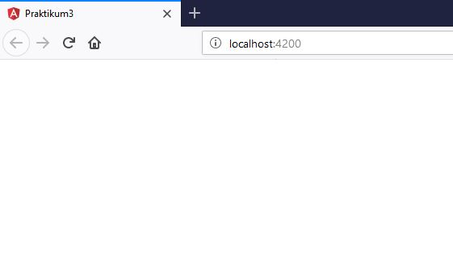
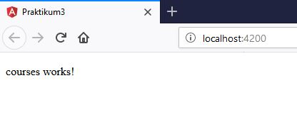
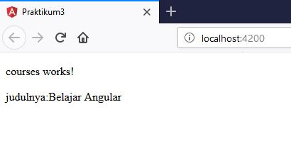
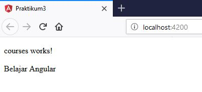
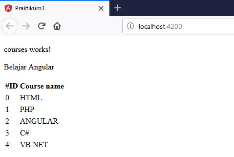
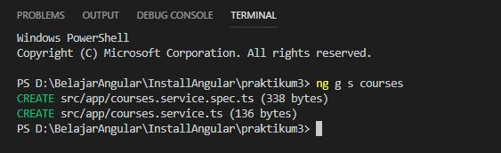
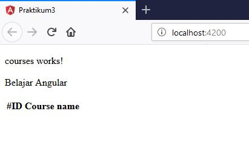
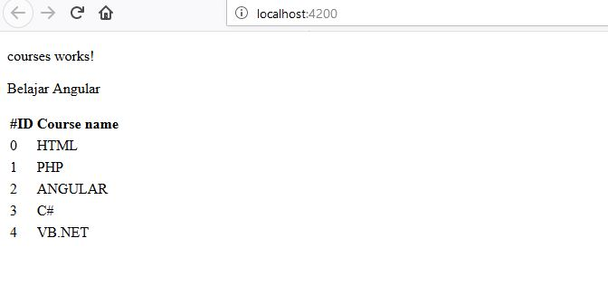

# Jobsheet 3 - Angular Fundamental	

### Praktikum – Bagian 1 : Component Basic

- Buatlah sebuah componen dengan nama courses dengan cara ng generate component name atau ng g c name

```typescript
<app-courses></app-courses>
<router-outlet></router-outlet>
```

- Kemudian jalankan perintah `ng serve`


- Buka file app.modules.ts dan hapus coursecomponent pada declarations

```typescript
import { BrowserModule } from '@angular/platform-browser';
import { NgModule } from '@angular/core';

import { AppRoutingModule } from './app-routing.module';
import { AppComponent } from './app.component';
import { CoursesComponent } from './courses/courses.component';

@NgModule({
  declarations: [
    AppComponent,
    // CoursesComponent
  ],
  imports: [
    BrowserModule,
    AppRoutingModule
  ],
  providers: [],
  bootstrap: [AppComponent]
})
export class AppModule { }
```

- Soal 3



- Lakukan inspect pada halaman. Terdapat error setelag Go to Definition , app-course merupakan elemen yang tidak diketahui: 

###Praktikum – Bagian 2: Templates

- Buka file courses.component.ts tambahkan property baru dengan nama title

```typescript
import { Component, OnInit } from '@angular/core';
import { CoursesService } from '../courses.service';

@Component({
  selector: 'app-courses',
  templateUrl: './courses.component.html',
  styleUrls: ['./courses.component.css']
})
export class CoursesComponent implements OnInit {

  title = 'Belajar Angular';
  constructor(){

  }
  ngOnInit() {
  }

}
```

- Soal 5 Kemudian buka browser localhost:4200



- Tambahkan string pada binding data. Buka file courses.component.html. tambahkan seperti berikut:

```typescript
<p>
  courses works!
</p>
<p>
    {{"judulnya:" + title}}
</p>
```

- Soal6 kemudian refresh browser



- Buka file courses.component.ts dan buatlah sebuah method dengan nama getTitle seperti berikut ini :

```typescript
import { Component, OnInit } from '@angular/core';
import { CoursesService } from '../courses.service';

@Component({
  selector: 'app-courses',
  templateUrl: './courses.component.html',
  styleUrls: ['./courses.component.css']
})
export class CoursesComponent implements OnInit {

  title = 'Belajar Angular';
  getTitle(){
      return this.title;
  }
  constructor(){

  }
  ngOnInit() {
  }

}
```

- Buka file courses.component.html, lakukan modifikasi seperti berikut:

- Soal 7 refresh dan perhatikan hasilnya



###Praktikum - Bagian 3: Directive

- Buka file courses.component.ts dan buat properti dengan nama course dengan data berupa array

```typescript
import { Component, OnInit } from '@angular/core';
import { CoursesService } from '../courses.service';

@Component({
  selector: 'app-courses',
  templateUrl: './courses.component.html',
  styleUrls: ['./courses.component.css']
})
export class CoursesComponent implements OnInit {

  title = 'Belajar Angular';
  Courses = [
    {id: 0, name:'HTML'},
    {id: 1, name:'PHP'},
    {id: 2, name:'ANGULAR'},
    {id: 3, name:'C#'},
    {id: 4, name:'VB.NET'},
  ]
  getTitle(){
    return this.title;
  }
  
  constructor() { }

  ngOnInit() {
  }
}
```

- Buka file courses.component.html tambahkan directive ngFor dan string interpolation seperti berikut:

- Soal 8 refresh dan perhatikan hasilnya



###Praktikum – Bagian 4: Services dan Dependency Injection

- Buatlah service baru yang bernama courses dengan perintah : `ng generate service` courses atau `ng g s courses`



- Buka file courses.service.ts kemudian tambahkan method getCourse seperti berikut:

```typescript
import { Injectable } from '@angular/core';

@Injectable({
  providedIn: 'root'
})
export class CoursesService {

  constructor() { }

  getCourses() {
    return [
    {id: 0, name:'HTML'},
    {id: 1, name:'PHP'},
    {id: 2, name:'ANGULAR'},
    {id: 3, name:'C#'},
    {id: 4, name:'VB.NET'},
    ];
  }
}
```

- Soal 10 dan hasilnya seperti berikut:



- Tambahkan constructor pada file courses.component.ts seperti berikut:

```typescript
import { Component, OnInit } from '@angular/core';
import { CoursesService } from '../courses.service';

@Component({
  selector: 'app-courses',
  templateUrl: './courses.component.html',
  styleUrls: ['./courses.component.css']
})
export class CoursesComponent implements OnInit {

  title = 'Belajar Angular';
  Courses;

  constructor(private service:CoursesService) {
    this.Courses=service.getCourses();
  }

  ngOnInit() {
  }
}
```

- Soal 11 dan hasilnya seperti berikut:




